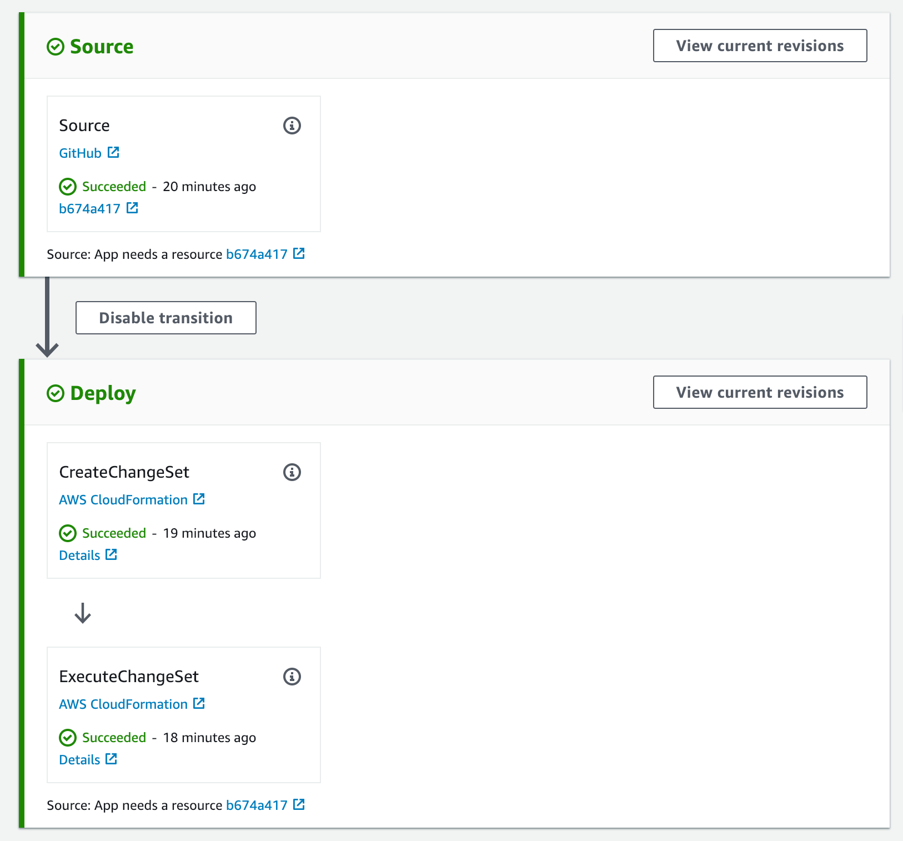

# GitHub CodePipeline example

This is a "walking skeleton" application that you can modify to create a Continuous Delivery / Continuous Deployment (CD) Pipeline
with [AWS CodePipeline](https://aws.amazon.com/codepipeline/), and [GitHub](https://github.com/) as a source repository provider.

CD Pipelines define the application to be deployed using an ["Infrastructure as Code"](https://en.wikipedia.org/wiki/Infrastructure_as_code) (IaC) strategy, and in our case we use [AWS CloudFormation](https://aws.amazon.com/cloudformation/) as our IaC tool. The definition of the application to be deployed can be found in the [`application.yaml`](./application.yaml) template.

Moreover the *pipeline itself* is defined in code, also using CloudFormation, and its definition is the [`pipeline.yaml`](./pipeline.yaml) template. The benefits of defining a CD pipeline in versioned source are the same as those for defining an application's deployment in source - automatibilty, visibility, etc. 

We define the pipeline in the same repository as the application itself - this is possible since AWS CodePipeline provides *CD as a service* - we do not need to manage any pipeline servers. Keeping the CD definition closely tied to the application definition allows us to make infrastructural changes quickly and simply.

GitHub is an extremely popular location to host source code for applications, and this example uses GitHub as its source code location. We define the integration between AWS and GitHub solely within the Pipeline's template - no manual use of the AWS Console or CodePipeline API are required.

As part of the GitHub integration we make use of CodePipeline's ["GitHub Webhook"](https://docs.aws.amazon.com/codepipeline/latest/userguide/pipelines-webhooks.html) feature to allow for executions that trigger more quickly, and that allow source event filtering.



## How to create the pipeline

1. Fork this repository to your own GitHub repository

1. Update the `GitHubOwner` and `GitHubRepo` default parameter values in [`pipeline.yaml`](./pipeline.yaml) for your fork.

1. Create a new GitHub personal access token for this application. See [here](https://help.github.com/articles/creating-a-personal-access-token-for-the-command-line/) for how to do this - CodePipeline needs just the `repo` scope permissions. I recommend you name the token for this particular pipeline, at least to get started, and that you store the token somewhere safe, like a password manager.

1. :warning: The user associated with the personal access token above **MUST** have administrative rights for the Github repo - either by being an owner of the repo, or having been granted admin privs. Simply having write access is not sufficient, because this template attempts to create a webhook in Github. If your user has insufficient privileges the pipeline creation process will fail, but will create an stranded / undeletable version of your application stack.

1. By default the application CloudFormation stack will be named `github-codepipeline-app`, and the CodePipeline stack will be named `github-codepipeline`. If / when you want to change these then update the following files, looking for references to `github-codepipeline` :
    * `application.yaml`
    * `create-pipeline.sh`
    * `update-pipeline.sh`
    * `pipeline.yaml`

1. Commit all your changes to source control

1. Now from a terminal run the following (this assumes the AWS CLI is installed and configured). Make sure the terminal is configured to use the AWS region where you want the pipeline itself to run (or override using the `--region` flag), and that it is configured to use the account where the pipeline and application will run. Provide the GitHub token value that you created in step 3.

``` bash
$ ./create-pipeline.sh YOUR-GITHUB-TOKEN
```

Once you've run this last command then watch both the CloudFormation and then CodePipeline consoles to evaluate whether the process has been successful. You should have two new CloudFormation stacks - one for the pipeline and one for the application, and you should be able to see a new Pipeline in CodePipeline.

To test everything, after the pipeline has successfully completed it's first run, check the S3 console to see whether the new application bucket (as defined in [`application.yaml`](./application.yaml)) has been created.

## How to update the pipeline

When you need to update the application code or structure (as defined in [`application.yaml`](./application.yaml)), then simply pushing your changes to source control will be sufficient - CodePipeline references these files from source on every pipeline run.

If you need to change the structure of the CodePipeline itself then run `update-pipeline.sh` with the same GitHub token argument that you ran with `create-pipeline.sh`. If you no longer have the token then create a new one and use that.

## Teardown

:warning: Run these steps **in order**, otherwise you may end up with stranded resources:

1. Delete the application stack
1. Delete the artifact bucket created by the pipeline
1. Delete the pipeline stack

## Questions, Comments, Additions, Suggestions

If you have any questions, comments, additions or suggestions please feel free to comment through GitHub, on twitter at [@mikebroberts](https://twitter.com/mikebroberts), or via email at mike@symphonia.io.

If your company is looking for help using CodePipeline, CloudFormation, or architecture using AWS then please contact us at [Symphonia](https://www.symphonia.io/).

## TODO

* Refine IAM permissions in pipeline.yaml